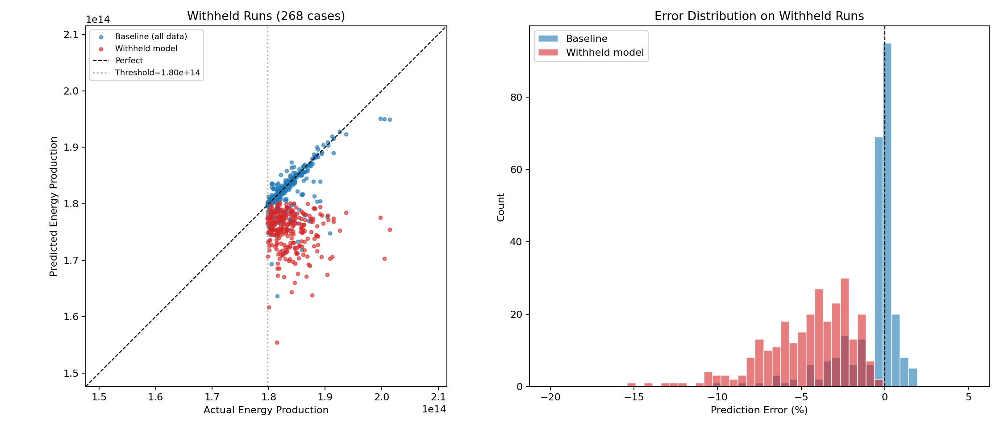

# Withholding Analysis: Top 10% Energy Production

## Setup

- **Withheld model**: trained on bottom 90% of runs (top 10% by `graph_energy_total` removed)
- **Baseline model**: trained on all runs (no withholding)
- **Withheld subset**: 268 runs with actual > 1.80e+14
- **Non-withheld subset**: 2408 runs

## Results on Withheld Runs (never seen by withheld model)

| Metric | Withheld Model | Baseline (all data) | Ratio |
|---|---:|---:|---:|
| MAE | 8.45e+12 | 1.87e+12 | 4.5× |
| MAPE | 4.57% | 1.01% | 4.5× |
| RMSE | 9.83e+12 | 3.41e+12 | 2.9× |
| Median AE | 7.43e+12 | 6.37e+11 | 11.7× |
| Max Error % | 15.0% | 9.8% | 1.5× |

## Results on Non-Withheld Runs (training distribution)

| Metric | Withheld Model | Baseline (all data) | Ratio |
|---|---:|---:|---:|
| MAE | 1.35e+12 | 1.72e+12 | 0.8× |
| MAPE | 0.88% | 1.13% | 0.8× |
| RMSE | 3.11e+12 | 3.24e+12 | 1.0× |

## Key Takeaways

The withheld model **systematically underpredicts** the top-10% runs (pred range caps near the
training threshold of 1.80e+14). This is expected behavior — the model has no exposure
to the high-energy regime and cannot extrapolate beyond its training distribution.

The baseline model, having seen these runs during training, achieves substantially lower error
on this subset. On the non-withheld subset, both models perform comparably, confirming that
withholding does not degrade performance within the training distribution.

